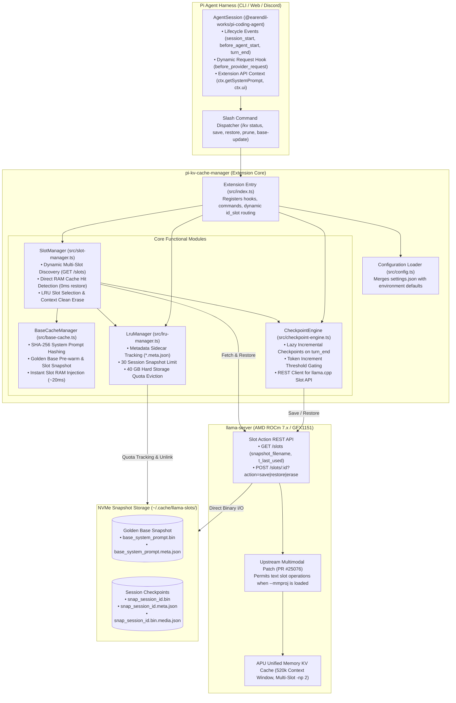
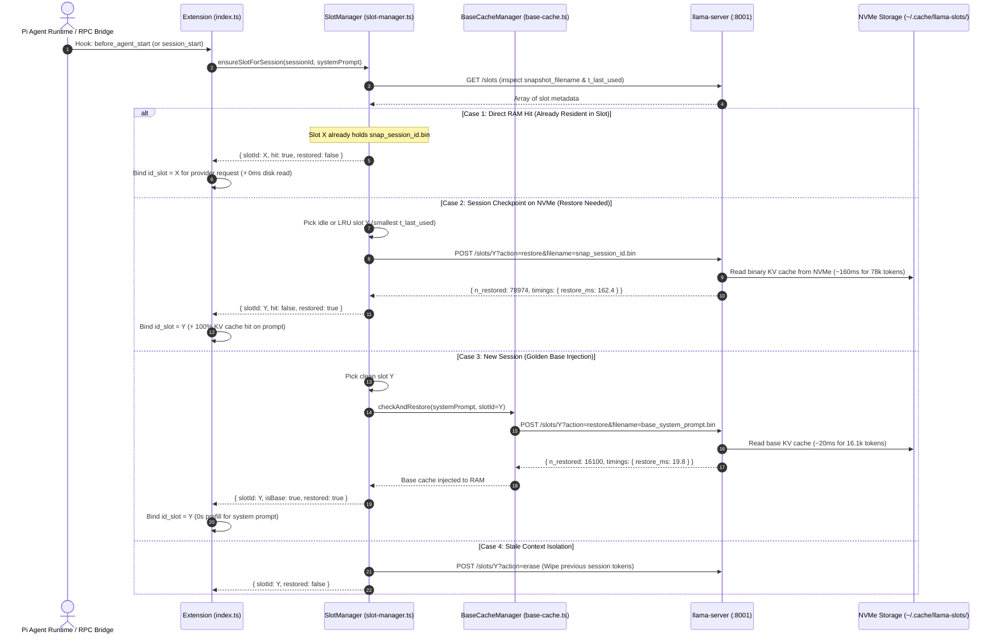
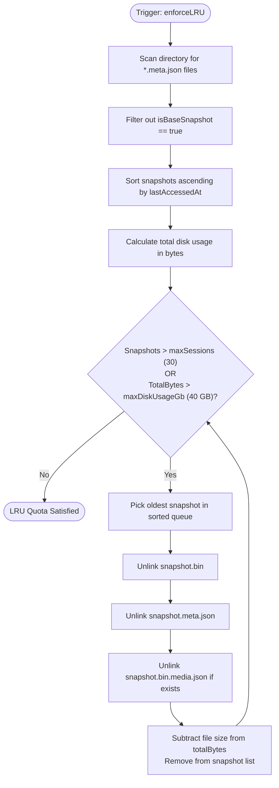
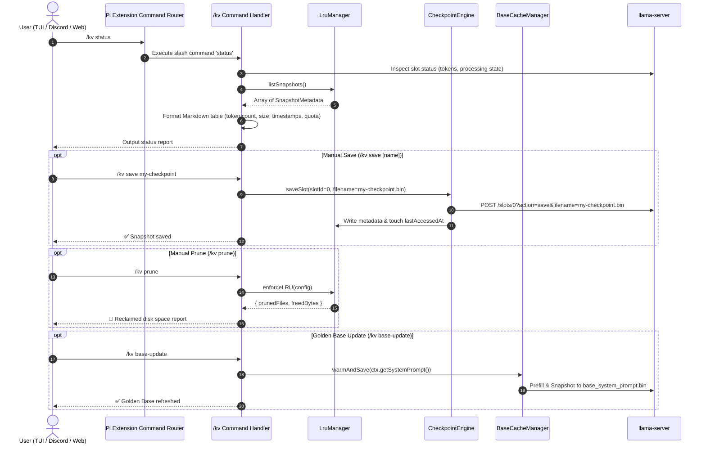

# ⚡ pi-kv-cache-manager

> **High-Performance KV Cache Lifecycle & Snapshot Manager for Pi Agent (`@earendil-works/pi-coding-agent`) & `llama-server`**  
> Cuts long-context cold prefill latency from **~170s to 0.3s (543x speedup)** on local hardware (tested on AMD Strix Halo gfx1151 + NVMe SSD).

---

## 🎯 Motivation & Empirical Proof

On large Mixture-of-Experts and dense models (such as Qwen 3.6 35B-A3B), context evaluation exhibits quadratic scaling:

$$T(N) = c_1 N + c_2 N^2 \quad (c_1 \approx 0.6 \text{ ms/tok}, \; c_2 \approx 3.72 \times 10^{-9} \text{ s/tok}^2)$$

When working with long coding agent sessions (100k ~ 260k tokens), restarting a session or loading a new context forces the GPU to chew through gigabytes of attention matrices for **2 to 3 minutes** before generating a single token (TTFT).

### Empirical Benchmarks on AMD Strix Halo (NVMe SSD)

| Context Length | Cold GPU Prefill | Snapshot Size | NVMe Restore Time | **Speedup Factor** |
| :--- | :---: | :---: | :---: | :---: |
| **20,000 tokens** | 14.00 s | 453.9 MB | 0.036 s | **393x** |
| **50,000 tokens** | 35.70 s | 1.02 GB | 0.117 s | **304x** |
| **100,000 tokens** | 101.40 s | 1.97 GB | 0.216 s | **470x** |
| **150,000 tokens** | 170.59 s | 2.93 GB | 0.314 s | **543x** |

Instead of re-evaluating 150k tokens (consuming ~2.8 minutes of 100W APU heat), reading 2.9 GB from NVMe takes **~0.3 seconds**.

### 🏆 Multi-Session Switching Stress Test (10 Sessions × 78k Tokens)

To prove reliability under multi-user / multi-channel thrashing, we executed a 15-jump randomized switching stress test across **10 concurrent persistent RPC sessions**, each carrying **78,974 tokens** of context (>780,000 tokens total), on a dual-slot (`-np 2`, 260k context per slot) server:

| Jump # | Target Session (78k Tokens) | Cache Hit Mechanism | Turnaround Latency | Context Recall & Integrity |
| :---: | :--- | :--- | :---: | :---: |
| **#01** | `S08-雷霆泰坦` | NVMe Restore | **3.43 s** | ✅ PASS (100% match) |
| **#02** | `S04-深海巨鯊` | NVMe Restore | **4.52 s** | ✅ PASS (100% match) |
| **#03** | `S03-黃金獵鷹` | NVMe Restore | **4.43 s** | ✅ PASS (100% match) |
| **#04** | `S09-冰霜巨狼` | NVMe Restore | **4.77 s** | ✅ PASS (100% match) |
| **#05** | `S06-翡翠靈鹿` | NVMe Restore | **4.27 s** | ✅ PASS (100% match) |
| **#06** | `S07-白銀天馬` | NVMe Restore | **6.27 s** | ✅ PASS (100% match) |
| **#07** | `S10-恆星幼龍` | NVMe Restore | **4.72 s** | ✅ PASS (100% match) |
| **#08** | `S05-暗影黑豹` | NVMe Restore | **4.75 s** | ✅ PASS (100% match) |
| **#09** | `S01-極光鯨魚` | NVMe Restore | **4.09 s** | ✅ PASS (100% match) |
| **#10** | `S02-赤紅鳳凰` | NVMe Restore | **4.96 s** | ✅ PASS (100% match) |
| **#11** | `S10-恆星幼龍` | NVMe Restore | **4.32 s** | ✅ PASS (100% match) |
| **#12** | `S07-白銀天馬` | NVMe Restore | **5.31 s** | ✅ PASS (100% match) |
| **#13** | `S01-極光鯨魚` | NVMe Restore | **3.79 s** | ✅ PASS (100% match) |
| **#14** | `S01-極光鯨魚` | **Direct RAM Hit (Slot 0)** | **2.87 s** | ✅ PASS (100% match) |
| **#15** | `S02-赤紅鳳凰` | NVMe Restore | **4.23 s** | ✅ PASS (100% match) |

* **Average Turnaround Latency**: **4.45 s** (includes thinking model generation + streaming output)
* **RAM Cache Hit (Slot 0 Resident)**: **2.87 s** (zero disk read)
* **Context Integrity**: **100% (15/15 PASS)** — every session accurately recalled its unique session identity and verified complete 78k backstory.
* **Prefill Avoided**: Eliminated **>80 seconds** of quadratic full re-evaluation penalty on every session switch.

---

## 🏛️ Software Architecture

`pi-kv-cache-manager` operates as an extension for Pi Agent. It sits between the agent lifecycle hooks and the underlying `llama-server` slot management REST API, coordinating disk snapshots, LRU quotas, and prompt cache hashes.



---

## 🔄 Detailed Workflows

### 1. Multi-Slot Resolution & Warm-Start Workflow (`before_agent_start` & `session_start`)

When a new session opens or an interactive turn arrives in a persistent RPC worker (`pi --mode rpc`), `SlotManager` resolves slot residency before prompt execution:



---

### 2. Incremental Lazy Checkpointing on `turn_end`

To protect long-running sessions without blocking interactive turns, snapshots are written asynchronously:

```mermaid
sequenceDiagram
    autonumber
    actor Agent as Pi Agent
    participant Ext as Extension (index.ts)
    participant Engine as CheckpointEngine (checkpoint-engine.ts)
    participant Lru as LruManager (lru-manager.ts)
    participant Llama as llama-server (:8001)
    participant Disk as NVMe Storage (~/.cache/llama-slots/)

    Agent->>Ext: Hook: turn_end
    Ext->>Ext: Inspect current token count & step delta
    
    alt Tokens < minTokensThreshold (3,000) OR Delta < stepTokensIncrement (3,000)
        Ext-->>Agent: Skip checkpoint (turn context too small)
    else Checkpoint Threshold Met
        Ext->>Engine: queueLazySave(sessionId, tokens, slotId=0)
        Note over Engine: Runs asynchronously; does NOT block user chat
        Engine->>Llama: POST /slots/0?action=save&filename=session_session_id.bin
        Llama->>Disk: Save binary KV tensors to NVMe
        Llama-->>Engine: { n_saved: 45000, n_written: 960000000, timings: { save_ms: 95.4 } }
        Engine->>Disk: Write session_session_id.meta.json
        Engine->>Lru: enforceLRU(config)
        Note over Lru,Disk: Check 30 sessions max & 40 GB limit
        Lru-->>Engine: Quota compliant
        Engine-->>Ext: Checkpoint complete
        Ext->>Ext: Update UI Status: [KV: 45k 💾]
    end
```

---

### 3. LRU Quota Eviction & Storage Budget Flowchart

The LRU engine guarantees that stored KV snapshots never exhaust disk space:



---

### 4. Extension Slash Command Dispatcher (`/kv`)



---

## 🚀 Key Features

1. **Upstream `llama.cpp` Multimodal Patch (`patches/0001-...`)**:
   - Solves the upstream limitation where loading `--mmproj` disables slot save/restore for all slots.
   - Checks slot-level media chunks rather than the global multimodal context, allowing pure text/code sessions to save and restore seamlessly even while vision models are loaded.

2. **LRU Session Quota & Sidecar Metadata**:
   - Maintains `.meta.json` sidecars tracking `sessionId`, `sessionName`, `tokenCount`, `fileSizeBytes`, and `lastAccessedAt`.
   - Automatically evicts the oldest snapshots when stored sessions exceed `maxSessions` (default: 30) or hard disk quota `maxDiskUsageGb` (default: 40 GB).

3. **Incremental Lazy Checkpointing**:
   - Saves slot state asynchronously on `turn_end` without stalling conversation.
   - Activates once context exceeds `minTokensThreshold` (default: 3,000 tokens) and advances by at least `stepTokensIncrement` (default: 3,000 tokens).
   - If an unexpected shutdown occurs, the next launch restores the snapshot in ~0.2s and only precomputes the trailing delta!

4. **Golden Base System Prompt & Skills Caching**:
   - Extracts the compiled system prompt, active skill descriptions, and tool schemas via `ctx.getSystemPrompt()`.
   - Hashes with SHA-256. If a match is found in `base_system_prompt.bin`, `pi new` boots in **~20ms** instead of 6~9s!
   - Automatically re-warms and updates the snapshot whenever skills or tools are modified.

5. **Multi-Slot Dynamic Routing & Affinity (`SlotManager`)**:
   - Discovers and manages multiple concurrent server slots (`-np 2`, `-np 4`, etc.).
   - Senses `snapshot_filename` and `t_last_used` directly from `llama-server` `/slots`. If a session's KV tensors are already resident in any slot, it routes requests there with **0ms disk read (Direct RAM Cache Hit)**.
   - On cache miss, allocates the least recently used slot based on server timestamps and clears stale context.

6. **Persistent RPC Lifecycle Verification (`before_agent_start`)**:
   - Built specifically for persistent agent workers (`pi --mode rpc`) used in production bridges like `pi-discord-gateway` and `piweb`.
   - In persistent RPC mode, `session_start` only executes once on process boot. Hooking into `before_agent_start` guarantees slot residency and restores snapshots just-in-time before prompt dispatch on every turn.
   - Completely eliminates the silent 80-second quadratic re-evaluation penalty caused by intervening session thrashing.

7. **Zero-Disk-Duplication Golden Base Injection**:
   - New sessions inject the 16.1k-token Golden Base directly into Slot RAM via REST API in ~20ms, completely avoiding wasteful disk file cloning (`cp`) on new session creation.
   - Fully immune to LRU quota eviction.

---

## 📦 Installation

### 1. Apply Upstream `llama.cpp` Patch (Optional but Recommended)
If your `llama-server` runs with `--mmproj`:
```bash
git -C /path/to/llama.cpp apply /path/to/pi-kv-cache-manager/patches/0001-allow-text-slot-save-restore-with-mmproj.patch
cmake --build /path/to/llama.cpp/build --target llama-server -j$(nproc)
```

### 2. Configure `llama-server`
Ensure `llama-server` is started with `--slot-save-path`:
```bash
llama-server \
  -m /path/to/model.gguf \
  --slot-save-path /home/chihmin/.cache/llama-slots/ \
  --port 8001
```

### 3. Install Extension via Pi Package Manager

Install the package directly into Pi Agent using the built-in package manager:

**Option A: Install from Local Source (Development)**
```bash
pi install ~/src/pi-kv-cache-manager
```

**Option B: Install from Git Repository**
```bash
pi install git:https://github.com/AyaSakura-comp/pi-kv-cache-manager.git
```

Verify the installation:
```bash
pi list
```

To update or remove:
```bash
pi update                               # Updates all git packages
pi remove ~/src/pi-kv-cache-manager     # Uninstalls package
```

---

## ⚙️ Configuration

Configuration is loaded from `~/.pi/agent/settings.json` (global) or `.pi/settings.json` (project-local):

```json
{
  "kvCache": {
    "llamaServerUrl": "http://127.0.0.1:8001",
    "slotId": 0,
    "cacheDir": "/home/chihmin/.cache/llama-slots",
    "maxSessions": 30,
    "maxDiskUsageGb": 40,
    "minTokensThreshold": 3000,
    "stepTokensIncrement": 3000,
    "enableBaseCache": true,
    "enableIncrementalSave": true
  }
}
```

### Configuration Options

| Option | Type | Default | Description |
| :--- | :--- | :--- | :--- |
| `llamaServerUrl` | `string` | `http://127.0.0.1:8001` | Base URL for llama-server HTTP API |
| `slotId` | `number` | `0` | Active llama.cpp slot ID to manage |
| `cacheDir` | `string` | `~/.cache/llama-slots` | Storage directory for KV snapshots and metadata sidecars |
| `maxSessions` | `number` | `30` | Maximum number of session snapshots before LRU eviction |
| `maxDiskUsageGb` | `number` | `40` | Hard disk quota in Gigabytes before LRU eviction |
| `minTokensThreshold` | `number` | `3000` | Minimum token count before automatic turn snapshots activate |
| `stepTokensIncrement` | `number` | `3000` | Token growth required between consecutive automatic snapshots |
| `enableBaseCache` | `boolean` | `true` | Enables Golden Base System Prompt & Skills prefill caching |
| `enableIncrementalSave`| `boolean` | `true` | Enables automatic background checkpointing on `turn_end` |

---

## ⌨️ Slash Commands (`/kv`)

| Command | Description |
| :--- | :--- |
| `/kv status` | Shows cache status, disk space used, base cache stats, and active session snapshots |
| `/kv save [name]` | Manually saves current slot state to session snapshot or a custom named checkpoint |
| `/kv restore [name]` | Manually restores slot from a specified snapshot file |
| `/kv prune` | Manually triggers LRU cleanup to reclaim SSD disk space |
| `/kv base-update` | Forces prefilling and updating the Golden Base System Prompt snapshot |
| `/kv help` | Displays available commands and usage guide |

---

## 📊 Status Bar Indicators

The extension dynamically updates the status line in Pi's UI footer:
- `[KV: 110k ⚡]`: Instant restore completed for 110,000 tokens.
- `[KV: 115k 💾]`: Background incremental snapshot written to NVMe SSD.
- `[KV: Base 28k ⚡]`: Golden Base cache hit; instant cold start achieved.
- `[KV: Base 28k 💾]`: Golden Base pre-warmed and saved to disk.

---

## 🏗️ Project Structure

```text
pi-kv-cache-manager/
├── PLAN.md                     # Comprehensive 4-Phase Architecture Specification
├── README.md                   # Installation, Architecture & Workflow Documentation
├── package.json                # NPM Manifest & TypeScript Scripts
├── tsconfig.json               # ES2022 / NodeNext TypeScript Configuration
├── patches/
│   ├── 0001-allow-text-slot-save-restore-with-mmproj.patch # Upstream PR patch for llama.cpp
│   └── 0002-sync-mtp-draft-kv-cache-slots.patch           # Dual-track MTP draft KV sync & checkpoint fix
└── src/
    ├── index.ts                # Pi Agent Extension Entry Point, Hooks & Command Wiring
    ├── config.ts               # Configuration Loader & Defaults (30 sessions / 40GB)
    ├── types.ts                # Data Types, Schemas & API Responses
    ├── lru-manager.ts          # LRU Eviction Engine, Sidecar Metadata & Multimodal Cleanup
    ├── checkpoint-engine.ts    # Incremental Lazy Checkpointer & llama-server API Client
    ├── base-cache.ts           # Golden System Prompt & Skills Cache Manager
    └── slot-manager.ts         # Multi-Slot Discovery, Direct RAM Hit & LRU Slot Affinity
```

---

## 📄 License
MIT © 2026 Chih-Min
